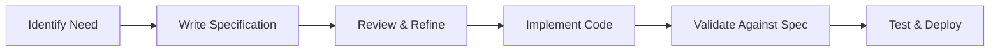

# Spec-Driven Development Guide for Symphony

## Overview
Symphony follows **Spec-Driven Development (SDD)** principles, where specifications define the "what" before implementation defines the "how". This ensures clear intent, comprehensive validation, and maintainable code.

## Core Principles

### 1. Specification First
Before writing any code:
- Define the intent and user story
- Document acceptance criteria
- Specify data contracts
- Plan test scenarios

### 2. Multi-Step Refinement
Specifications evolve through iterations:
- Initial high-level intent
- Detailed functional requirements
- Technical specifications
- Implementation guidelines

### 3. Contract-Driven Design
All data exchanges must have explicit contracts:
- JSON schemas for validation
- FHIR resource definitions
- API request/response formats
- LLM prompt/response structures

## Project Structure

```
Symphony/
├── specifications/              # All specs live here
│   ├── CONSTITUTION.md         # Project principles
│   ├── SPECIFICATION.md        # System overview
│   ├── features/               # Feature specifications
│   │   ├── 01-data-ingestion.md
│   │   ├── 02-summary-generation.md
│   │   └── 03-fhir-materialization.md
│   ├── architecture/           # Technical design
│   │   └── SYSTEM_DESIGN.md
│   └── testing/                # Test specifications
│       └── TEST_PLAN.md
├── backend/                    # Implementation
├── frontend/                   # Implementation
└── tests/                      # Test implementation
```

## Development Workflow

### 1. Feature Development


### 2. Specification Template
Every feature specification must include:

```markdown
# Feature: [Name]

## Intent
[Clear statement of purpose]

## User Story
As a [role], I want [capability] so that [benefit]

## Acceptance Criteria
- [ ] Criterion 1
- [ ] Criterion 2

## Technical Specifications
### API Contract
[Define request/response]

### Data Models
[Define structures]

### Validation Rules
[Define constraints]

## Test Scenarios
### Happy Path
### Edge Cases
### Error Cases

## Implementation Notes
[Guidelines and considerations]
```

### 3. Implementation Process

#### Step 1: Read the Specification
```bash
# Always start by reading the relevant spec
cat specifications/features/01-data-ingestion.md
```

#### Step 2: Implement Against the Spec
```python
# Code must match specification exactly
class DataIngestionService:
    """
    Implements specifications/features/01-data-ingestion.md
    """
    def ingest(self, request: IngestRequest) -> IngestResponse:
        # Implementation follows spec requirements
        pass
```

#### Step 3: Validate Compliance
```python
# Tests verify specification compliance
def test_ingestion_meets_spec():
    """Validates against 01-data-ingestion.md acceptance criteria"""
    service = DataIngestionService()
    response = service.ingest(valid_request)
    assert response.patient_reference  # Spec requirement
    assert response.resource_counts    # Spec requirement
```

## Specification Categories

### 1. Constitutional Specifications
Define unchangeable project principles:
- Core values
- Architectural decisions
- Quality standards

### 2. Feature Specifications
Define user-facing functionality:
- User stories
- Acceptance criteria
- Interaction flows

### 3. Technical Specifications
Define implementation details:
- API contracts
- Data schemas
- Integration points

### 4. Test Specifications
Define validation approach:
- Test strategies
- Coverage requirements
- Acceptance tests

## Tools & Automation

### Schema Validation
```python
# Use JSON Schema for contract validation
from jsonschema import validate

def validate_summary_contract(summary):
    with open('specifications/contracts/summary.json') as f:
        schema = json.load(f)
    validate(summary, schema)
```

### Specification Linting
```bash
# Check specification completeness
python scripts/spec_lint.py specifications/features/*.md
```

### Contract Testing
```python
# Automated contract validation
@pytest.mark.contract
def test_summary_contract():
    response = generate_summary(test_data)
    assert_matches_contract(response, 'summary_contract.json')
```

## Benefits of Spec-Driven Development

### 1. Clear Communication
- Stakeholders understand what will be built
- Developers know exactly what to implement
- Testers know what to validate

### 2. Reduced Ambiguity
- Explicit requirements prevent misunderstandings
- Data contracts eliminate integration issues
- Test scenarios clarify edge cases

### 3. Better Quality
- Specifications catch issues before coding
- Contract validation prevents bugs
- Comprehensive testing from specs

### 4. Easier Maintenance
- Specifications serve as documentation
- Changes require spec updates first
- Clear traceability from spec to code

## Common Patterns

### 1. Contract Evolution
```yaml
# Version 1.0
/api/ingest:
  required: [patientId, sourceUrl]

# Version 1.1 (backward compatible)
/api/ingest:
  required: [patientId, sourceUrl]
  optional: [dateRange, resourceTypes]
```

### 2. Specification Inheritance
```markdown
# Base specification
specifications/base/fhir-service.md

# Extended specifications
specifications/features/01-data-ingestion.md
  extends: base/fhir-service.md
  adds: [patient-specific logic]
```

### 3. Mock-First Development
```python
# Implement mock provider from spec
class MockLLMProvider:
    """Returns deterministic responses per specification"""
    def generate(self, input):
        return load_spec_example('summary_response.json')
```

## Best Practices

### DO:
- ✅ Write specs before code
- ✅ Keep specs up to date
- ✅ Version specifications
- ✅ Include examples in specs
- ✅ Validate against specs in CI/CD

### DON'T:
- ❌ Skip specification for "simple" features
- ❌ Implement without reading specs
- ❌ Change behavior without updating specs
- ❌ Write vague requirements
- ❌ Ignore test specifications

## Continuous Improvement

### Specification Reviews
- Weekly spec review meetings
- Stakeholder feedback sessions
- Developer retrospectives

### Metrics
- Spec coverage: % of features with specs
- Spec compliance: % of tests validating specs
- Spec quality: Completeness scores

### Evolution
- Regularly refine specifications
- Incorporate lessons learned
- Update patterns and templates

## Getting Started

### For New Features
1. Create specification in `/specifications/features/`
2. Get stakeholder approval
3. Implement against specification
4. Validate with tests
5. Update documentation

### For Bug Fixes
1. Check if spec exists
2. Determine if spec needs update
3. Fix implementation to match spec
4. Add test to prevent regression

### For Refactoring
1. Ensure specs are current
2. Refactor without changing specs
3. Validate behavior unchanged
4. Document improvements

## Resources

- [Spec-Kit Documentation](https://github.com/github/spec-kit)
- [JSON Schema](https://json-schema.org/)
- [FHIR Specifications](https://hl7.org/fhir/R4/)
- [OpenAPI Specification](https://swagger.io/specification/)

## Conclusion

Spec-Driven Development in Symphony ensures:
- **Clarity**: Everyone knows what's being built
- **Quality**: Specifications catch issues early
- **Maintainability**: Specs serve as living documentation
- **Confidence**: Implementation matches requirements

By following these principles, Symphony maintains high quality standards and delivers reliable healthcare software.